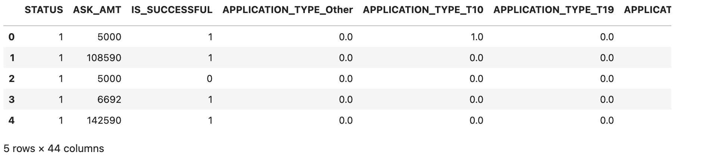
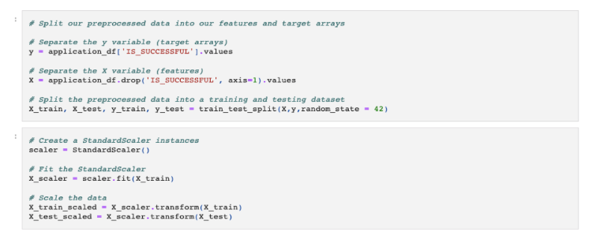
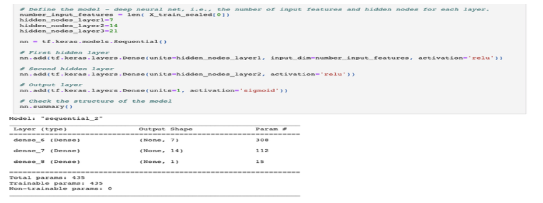
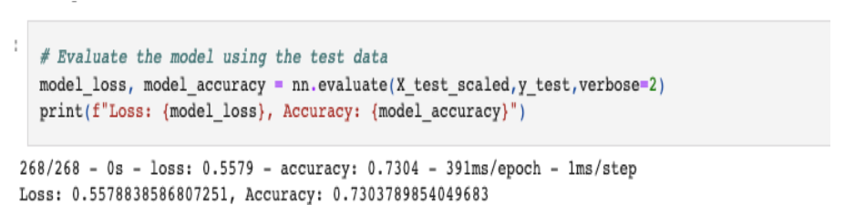
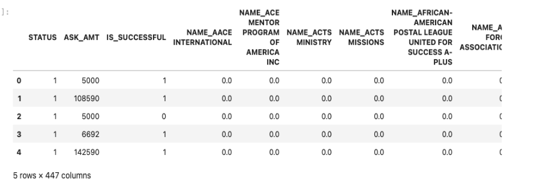
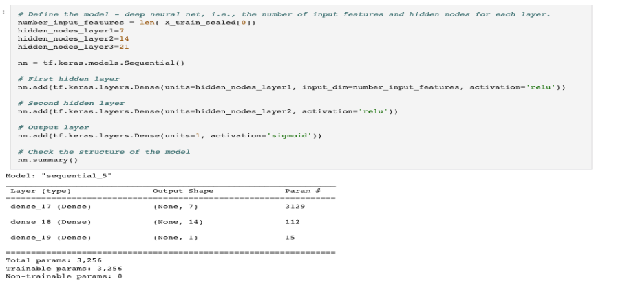
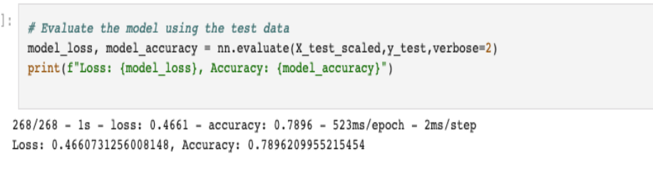

# Purpose
This analysis aims to deploy deep-learning and Neural networks to assist the Alphabet Soup company in determining the best allocation of their funds. This analysis used features in the dataset to create binary classifiers to predict if the fund recipient will succeed. This report outlines the steps taken to preprocess the data, select and train a suitable model, evaluate its performance, and make a recommendation based on the results.

# Results
## Model 1: Alphabet Soup Charity Model
* ### Data Preprocessing 
In this section, I explored the data to ensure it is processed and cleaned in a manner suitable for machine learning. Secondly, I used exploratory data analysis techniques to gain insights into the data distribution and identify patterns or correlations. This model removed the EIN and NAME columns; additionally, ‘Other’ replaced the CLASSIFICATION and APPLICATION_TYPE columns due to high fluctuations, as shown in Figure 1A below. Once the data was deemed suitable, I split the dataset into training and testing sets. The target variable for the model is “IS_SUCCESSFUL” and is verified by the value of 1 for YES and 0 for NO, as shown in Figure 1B below.

### Figure 1A: Model 1 Processed Data for Machine Learning
 
 
 ### Figure 1B: Model 1 Data Fitting
  
 
 * ### Compiling, Training, and Evaluating the Model
This model used the application of a neural network. The number of features dictated the number of hidden nodes. The number of features dictated the number of hidden nodes; a three-layer training model generated 435 parameters, as shown in Figure 2A. The target accuracy for this exercise is 75%; however, the model achieved only 72% accuracy, as shown in Figure 2B below.
 
 ### Figure 2A: Model 1 Input Features and Hidden Nodes and Parameters
   
   
 ### Figure 2B: Model 1 Accuracy Score
   
   
## Model 2: Alphabet Soup Charity Optimization Model
* ### Data Preprocessing
Model 2 followed the same data preprocessing steps as Model except for the columns deleted. Only the EIN column was deleted in this model, as shown in Figure 3 below.
### Figure 3: Model 3 Input Features and Hidden Nodes   
   

* ### Compiling, Training, and Evaluating the Model
  Like Model 1, this model used the application of a neural network. With the inclusion of the name column, a three-layer training model generated the number of parameters increases from 435 to 3,256,
as shown in Figure 4A below. This optimized model achieved almost 79% accuracy, 4% above the target accuracy of 75%, as shown in Figure 4B below.
### Figure 4A: Model 2 Input Features and Hidden Nodes and Parameters
   
   
### Figure 4B: Model 2 Accuracy Score   
   
   
## Conclusion/Recommendation
In deep learning and neural network, multiple layers are fundamental. The model places layers hierarchically, each processing and transforming the input data to extract higher-level features.
The deeper the network, the more abstract and complex the features it can learn and represent. Using multiple layers in deep learning offers several advantages:
* Representation power: Deep architectures can capture intricate patterns and relationships in the data, avoiding bias and making results fairer.
* Feature hierarchy: Each layer in a deep network can learn to represent different levels of abstraction, creating a hierarchical representation of the input data and allowing the model to understand the data more meaningfully.
* End-to-end learning: Multiple layers allow the model to directly map the raw input data to the desired output, avoiding the need for manual feature engineering.
When choosing the number of layers for a model, it is essential to consider that deeper models are not always better. Very deep networks can suffer from vanishing or exploding gradients, making training challenging. Additionally, deeper models require more computational resources and may be prone to overfitting when insufficient training data is unavailable. One should choose a neural network based on the complexity of the problem and the availability of data and computational resources. For some tasks, shallow networks might be sufficient; as seen in the optimized model, three layers with an additional column yield a desirable result of an accuracy score of 75% or higher.
   
## Tools and libraries used are:

* Python
* Google Colab
* Pandas SK-learn
* TensorFlow

